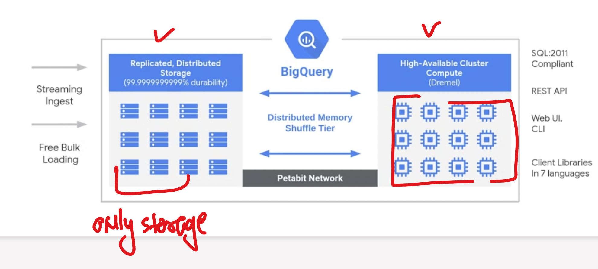
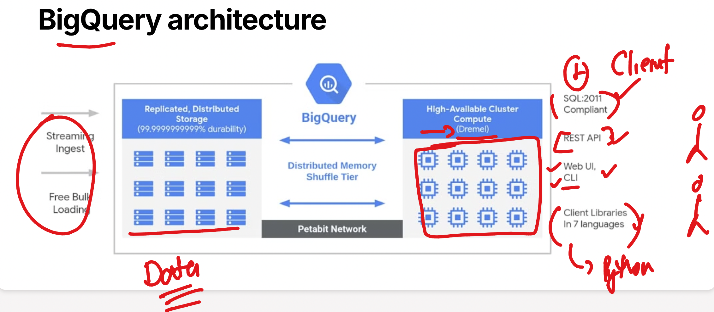
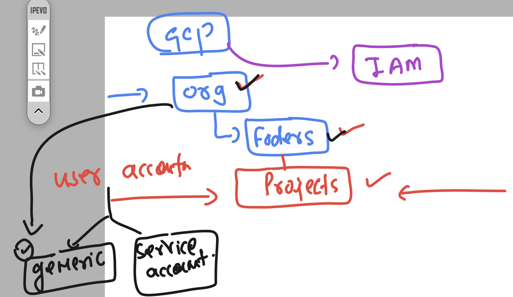
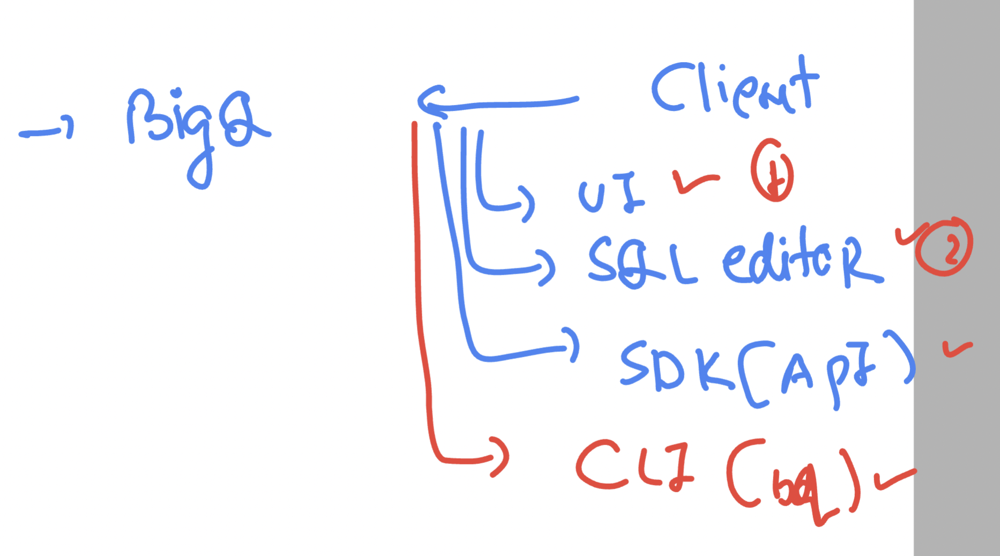
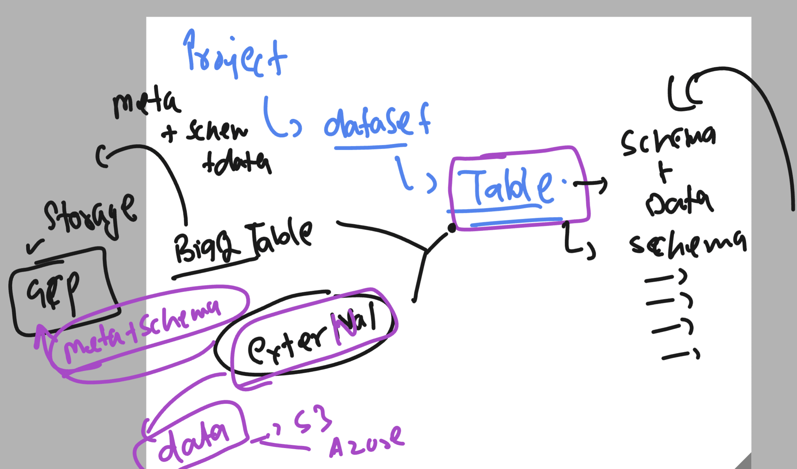
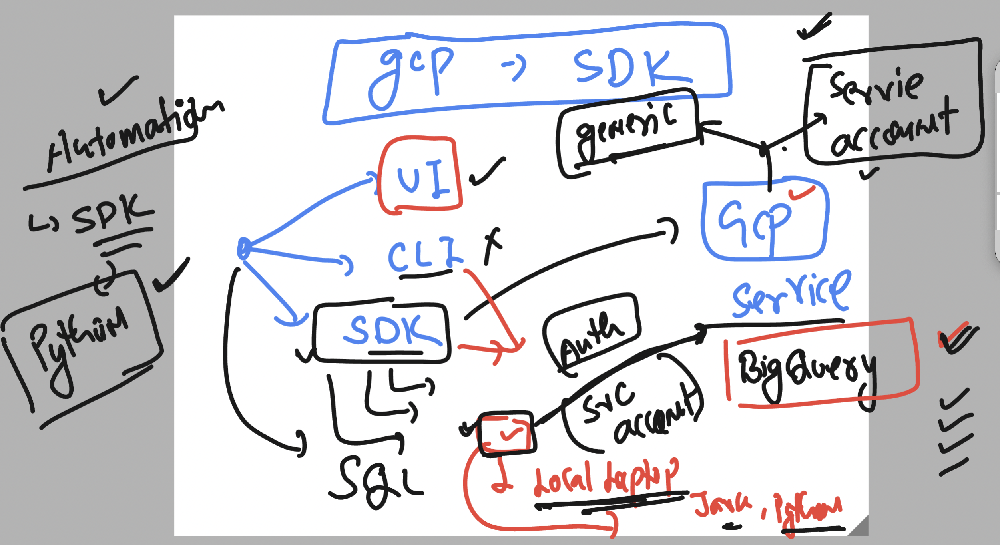
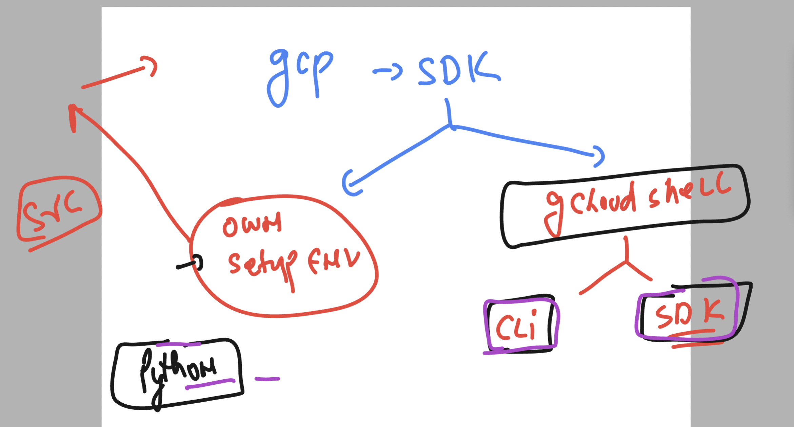
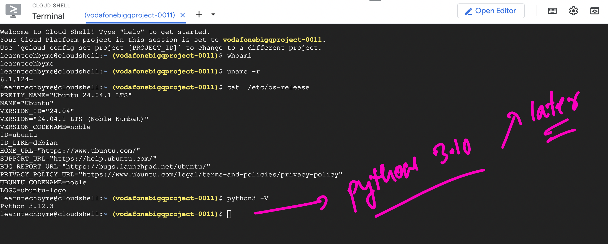
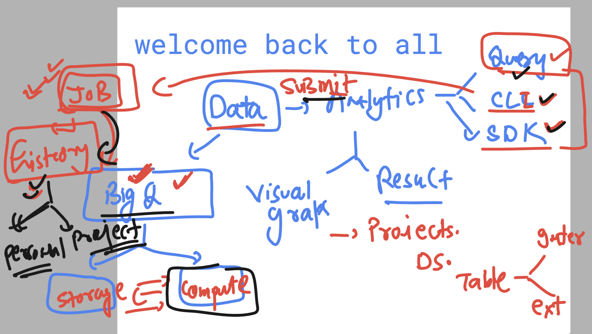
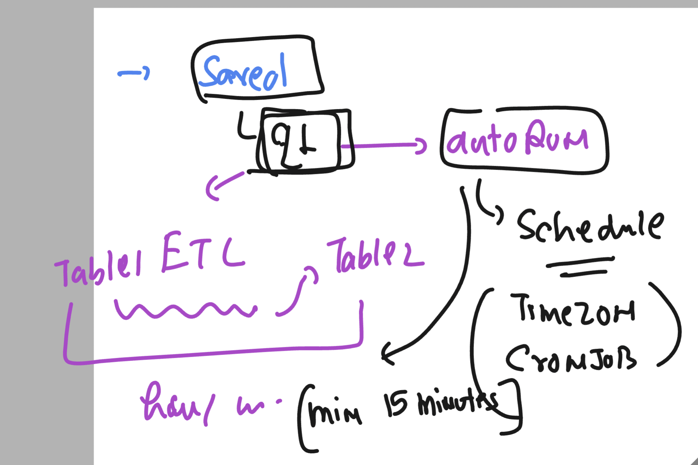

## architecture of BigQ



### BigQuery connection options 



### GCP --- cloud hierarchy 



### BigQ --- Client options 




## Creating dataset / schema 

### SQL query 

```sql
create schema `vodafonebigqproject-0011.ashu_dataset003`
options(
  location="US",
  default_table_expiration_days=10,
  description="this is dataset created by ashutoshh"

);
```

### deleting empty dataset with no tables at all

```sql
drop schema `vodafonebigqproject-0011.ashu_dataset003`;
```

### Intro to table in BigQ



### Query example of table 

```sql
SELECT name , sum(count) as my_count 
FROM `vodafonebigqproject-0011.ashu_dataset001.ashu_table2` 
GROUP BY name 
ORDER BY my_count DESC LIMIT 10;
```

### table query 2 

```sql

SELECT name ,gender, sum(count) as my_count 
FROM `vodafonebigqproject-0011.ashu_dataset001.ashu_table2` 
GROUP BY name , gender
ORDER BY my_count DESC LIMIT 10;

```

### Table query 3 

```sql
SELECT name ,gender, sum(count) as my_count 
FROM `vodafonebigqproject-0011.ashu_dataset001.ashu_table2` 
WHERE gender = 'F'
GROUP BY name , gender
ORDER BY my_count DESC LIMIT 10;
```

### CTAS 

```sql
create table `vodafonebigqproject-0011.ashu_dataset001.ashu_table3` AS
SELECT name ,gender, count 
FROM `vodafonebigqproject-0011.ashu_dataset001.ashu_table2` ;
```

## Connecting to BigQ using SDK of GCP 



### GCP SDK 




### GCP shell 



### checking bigquery lib

```

learntechbyme@cloudshell:~ (vodafonebigqproject-0011)$ pip list  | grep -i google-cloud 
google-cloud-aiplatform               1.76.0
google-cloud-appengine-logging        1.5.0
google-cloud-audit-log                0.3.0
google-cloud-bigquery                 3.27.0
google-cloud-core                     2.4.1
google-cloud-datastore                2.20.2
google-cloud-language                 2.16.0
google-cloud-logging                  3.11.3
google-cloud-resource-manager         1.14.0
google-cloud-spanner                  3.51.0
google-cloud-storage                  2.19.0
google-cloud-translate                3.19.0

```

### if need updated version then install google-cloud-bigquery as per pypi.org 
### always user virtual env in python 

```
learntechbyme@cloudshell:~ (vodafonebigqproject-0011)$ ls
learntechbyme@cloudshell:~ (vodafonebigqproject-0011)$ ls
ashucode1.py  README-cloudshell.txt
learntechbyme@cloudshell:~ (vodafonebigqproject-0011)$ python  -m venv ashu-env 
learntechbyme@cloudshell:~ (vodafonebigqproject-0011)$ ls
ashucode1.py  ashu-env  README-cloudshell.txt
learntechbyme@cloudshell:~ (vodafonebigqproject-0011)$ source  ashu-env/bin/activate
(ashu-env) learntechbyme@cloudshell:~ (vodafonebigqproject-0011)$ 
(ashu-env) learntechbyme@cloudshell:~ (vodafonebigqproject-0011)$ 
(ashu-env) learntechbyme@cloudshell:~ (vodafonebigqproject-0011)$ pip install google-cloud-bigquery==3.29.0
Collecting google-cloud-bigquery==3.29.0
  Downloading google_cloud_bigquery-3.29.0-py2.py3-none-any.whl.metadata (7.6 kB)
Collecting google-api-core<3.0.0dev,>=2.11.1 (from google-api-core[grpc]<3.0.0dev,>=2.11.1->google-cloud-bigquery==3.29.0)
  Downloading google_api_core-2.24.0-py3-none-any.whl.metadata (3.0 kB)
Collecting google-auth<3.0.0dev,>=2.14.1 (from google-cloud-bigquery==3.29.0)
  Downloading google_auth-2.38.0-py2.py3-none-any.whl.metadata (4.8 kB)
Collecting google-cloud-core<3.0.0dev,>=2.4.1 (from google-cloud-bigquery==3.29.0)

```

### checking version in python Interprator 

```
(ashu-env) learntechbyme@cloudshell:~ (vodafonebigqproject-0011)$ python
Python 3.12.3 (main, Jan 17 2025, 18:03:48) [GCC 13.3.0] on linux
Type "help", "copyright", "credits" or "license" for more information.
>>> from google.cloud import bigquery 
>>> bigquery.__version__
'3.29.0'
>>> exit()


(ashu-env) learntechbyme@cloudshell:~ (vodafonebigqproject-0011)$ deactivate 
learntechbyme@cloudshell:~ (vodafonebigqproject-0011)$ 
learntechbyme@cloudshell:~ (vodafonebigqproject-0011)$ 
learntechbyme@cloudshell:~ (vodafonebigqproject-0011)$ python
Python 3.12.3 (main, Jan 17 2025, 18:03:48) [GCC 13.3.0] on linux
Type "help", "copyright", "credits" or "license" for more information.
>>> from google.cloud import bigquery
>>> bigquery.__version__
'3.27.0'
>>> 

```

### version and sample code from pypi.org

[click_here](https://pypi.org/project/google-cloud-bigquery/)

## BIGQ is capturing job history 



### Scheduling query 



