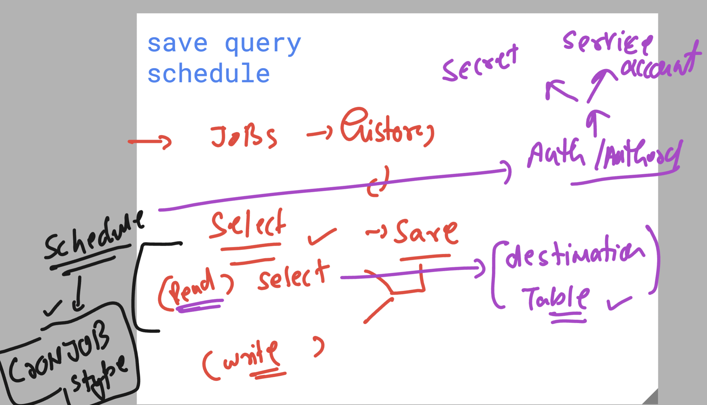
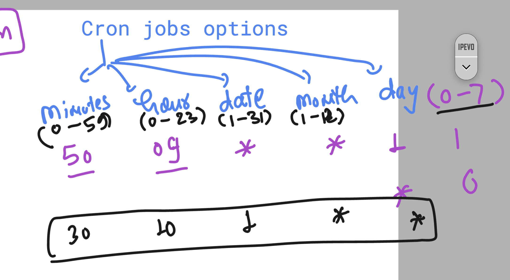
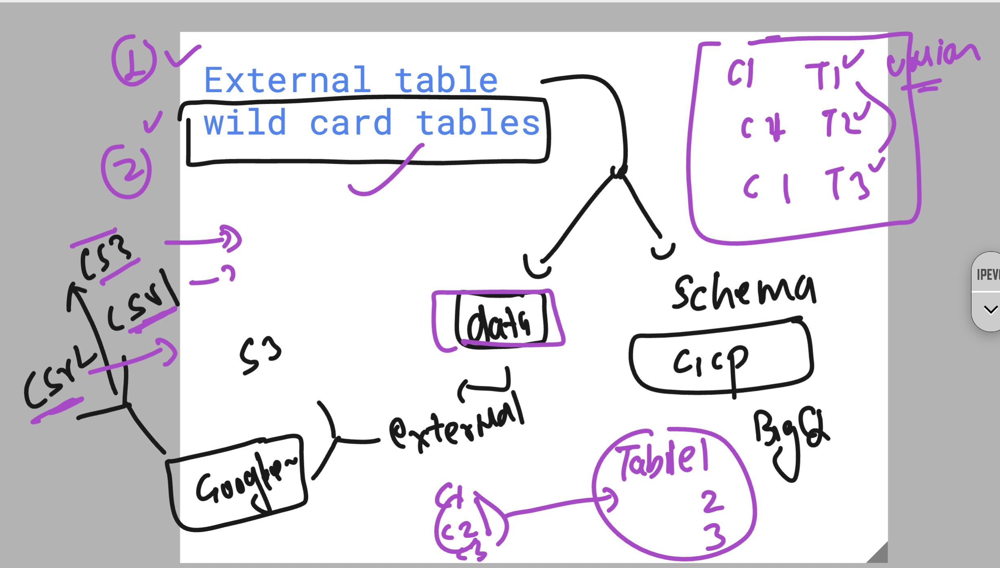
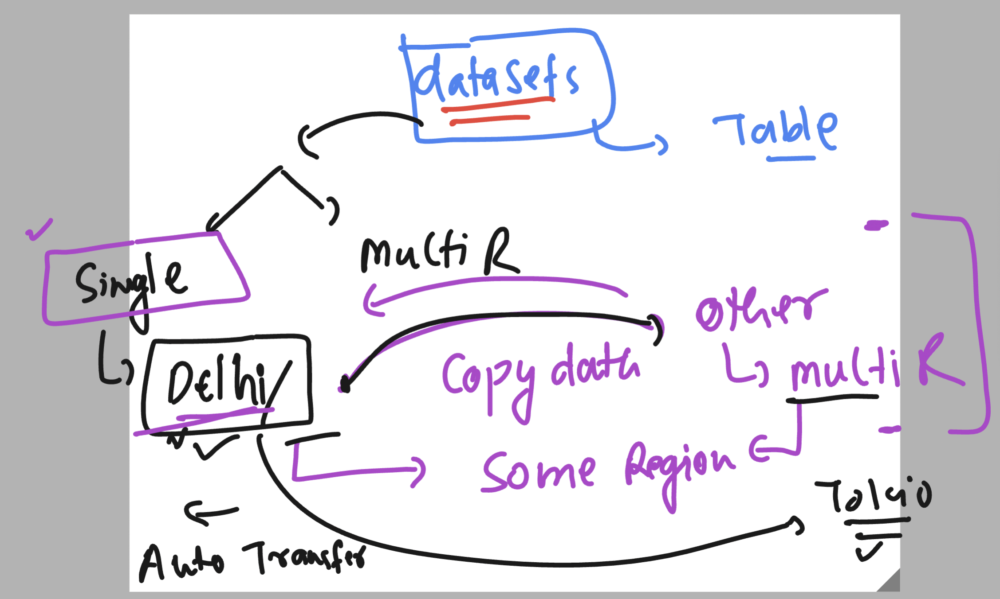
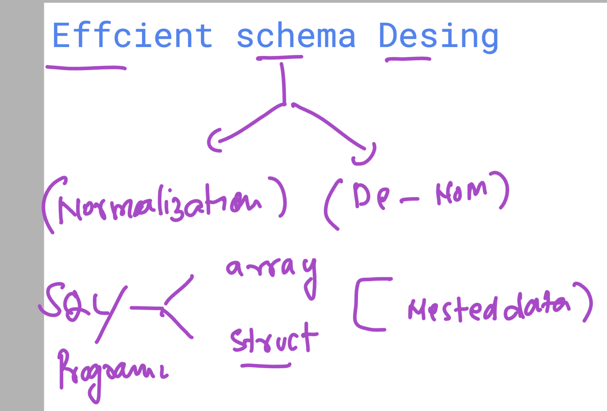
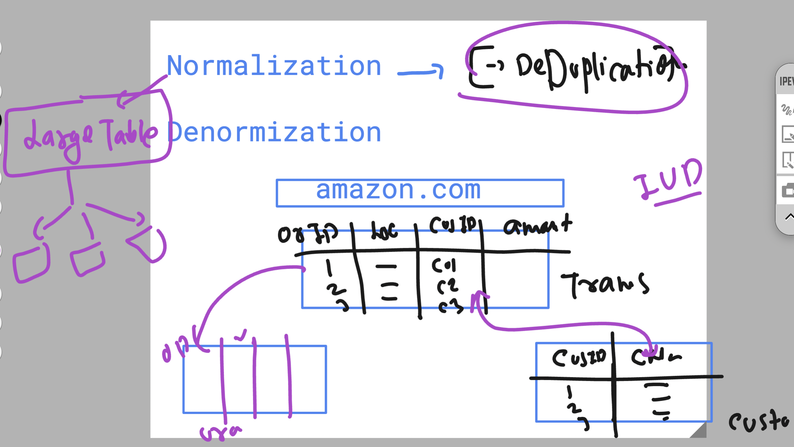
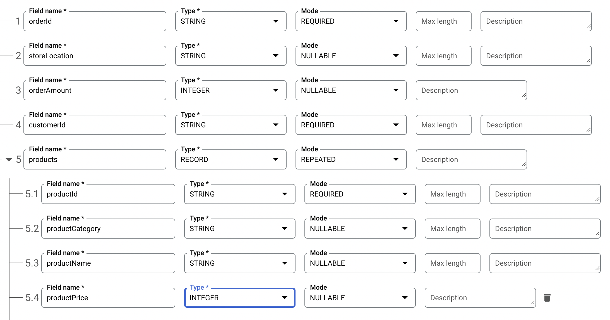

## revision 

### info basic 


### Collation in Bigquery 

[click_here](https://cloud.google.com/bigquery/docs/reference/standard-sql/collation-concepts)


### save and schedule query 



### cron job 




### External table and Wildcard table options 



### query to wildcard table 

```
  -- i want print give details from 1930 to 1939 below temperature is in fohrenhight 
SELECT
  mo,
  da,
  year,
  max
FROM
  `bigquery-public-data.noaa_gsod.gsod193*`
WHERE 
  max != 9999.9 
ORDER BY
  max DESC
```

### using _TABLE_SUFFIX in bigquery wildcard tables options 

```sql
  -- i want print give details from 1930 to 1939 below temperature is in farenheit
SELECT
  mo,
  da,
  year,
  ROUND((max-32)*5/9,1) celsius,
  max
FROM
  `bigquery-public-data.noaa_gsod.gsod193*`
WHERE
  max != 9999.9
  AND ( _TABLE_SUFFIX = '1'
    OR _TABLE_SUFFIX = '3'
    OR _TABLE_SUFFIX = '7' )
ORDER BY
  max DESC
```

## Drive data url 
### Orginal URL: https://drive.google.com/file/d/1c46Al6C2dB8m6uV0orRPa_LfR6A1qW4h/view?usp=drive_link

# BIG query supported URL 

https://drive.google.com/open?id=1c46Al6C2dB8m6uV0orRPa_LfR6A1qW4h

### dataset data transfer options 



## table alter options 

### changing data type of particular column to its compatible type 

```sql
ALTER TABLE
  `vodafonebigqproject-0011.ashudataset_002.ashu_table1_copy` ALTER COLUMN count
SET
  DATA type FLOAT64;
```

### changing existing column name 

```sql
ALTER TABLE
  `vodafonebigqproject-0011.ashudataset_002.ashu_table1_copy`
RENAME
  COLUMN name TO name_new
```

## Normalization vs DeNOM 



### Normalization 



# Normalization

## Definition

Normalization is the process of organizing data in a database into structured tables to:

- Reduce data redundancy (duplicate data).
- Improve data integrity.
- Simplify updates, inserts, and deletes without inconsistency.

## Goals

- Divide large tables into smaller, related tables.
- Ensure relationships between tables are well-defined using primary keys and foreign keys.

## Normal Forms

Normalization typically follows a set of rules called normal forms. The key normal forms are:

### First Normal Form (1NF)

- Each column contains atomic (indivisible) values.
- Each column contains values of a single type.

**Example:** Avoid multiple values in a single column.

| OrderID | ProductNames    |
|---------|-----------------|
| 1       | "Apple, Banana" |
| 1       | "Apple"         |

### Second Normal Form (2NF)

- Satisfies 1NF.
- Every non-key column must depend on the entire primary key, not just part of it.

### Third Normal Form (3NF)

- Satisfies 2NF.
- No transitive dependencies (a non-key column should not depend on another non-key column).

**Example of violation:**

If `City` depends on `PostalCode` and `PostalCode` depends on `CustomerID`, `City` indirectly depends on `CustomerID`.

## Advantages

- Data is stored efficiently, using minimal space.
- Reduces the risk of data anomalies during updates, inserts, or deletions.
- Easier to maintain consistency.

## Disadvantages

- Complex queries involving multiple joins to retrieve data.
- Slower query performance for large datasets due to fragmentation.

# Denormalization

## Definition

Denormalization is the process of combining related tables into larger, less-structured tables to:

- Optimize read performance.
- Simplify querying by reducing the need for joins.

## Goals

- Store redundant data to improve query speed.
- Reduce the complexity of SQL queries, especially for analytics and reporting.

**Example:**

Suppose you have normalized tables like this:

**Customers Table:**

| CustomerID | Name  |
|------------|-------|
| 1          | Alice |
| 2          | Bob   |

**Orders Table:**

| OrderID | CustomerID | Amount |
|---------|------------|--------|
| 101     | 1          | 500    |
| 102     | 2          | 700    |

In denormalization, you might combine these tables into one:

| OrderID | CustomerID | Name  | Amount |
|---------|------------|-------|--------|
| 101     | 1          | Alice | 500    |
| 102     | 2          | Bob   | 700    |

## Advantages

- Faster queries since data is pre-joined.
- Simplified schema for analytics and reporting.

## Disadvantages

- Increased storage requirements due to duplicate data.
- Higher risk of data anomalies during updates or deletions.
- Harder to enforce data integrity.

# Key Differences Between Normalization and Denormalization

| Aspect         | Normalization                     | Denormalization                  |
|----------------|-----------------------------------|----------------------------------|
| Purpose        | Reduce redundancy and anomalies   | Optimize read performance        |
| Data Structure | Divides data into smaller tables  | Combines tables into fewer tables|
| Query Complexity | Involves joins for retrieval    | Fewer joins needed               |
| Storage        | Requires less storage             | Uses more storage                |
| Use Case       | OLTP systems (transactional data) | OLAP systems (analytical queries)|

## When to Use What?

- **Normalization** is best for transactional systems (OLTP) where data integrity and minimizing redundancy are crucial.
- **Denormalization** is better for analytical systems (OLAP) where fast query performance and simplified querying are priorities.

### creating table with manual schema json data



### query with data

```
SELECT
  orderId,storeLocation,pd.*
FROM
  `vodafonebigqproject-0011.ashu_dataset001.ashu_nested_table001`
CROSS JOIN
  UNNEST(products) AS pd
WHERE
  pd.productName = "Table"

```