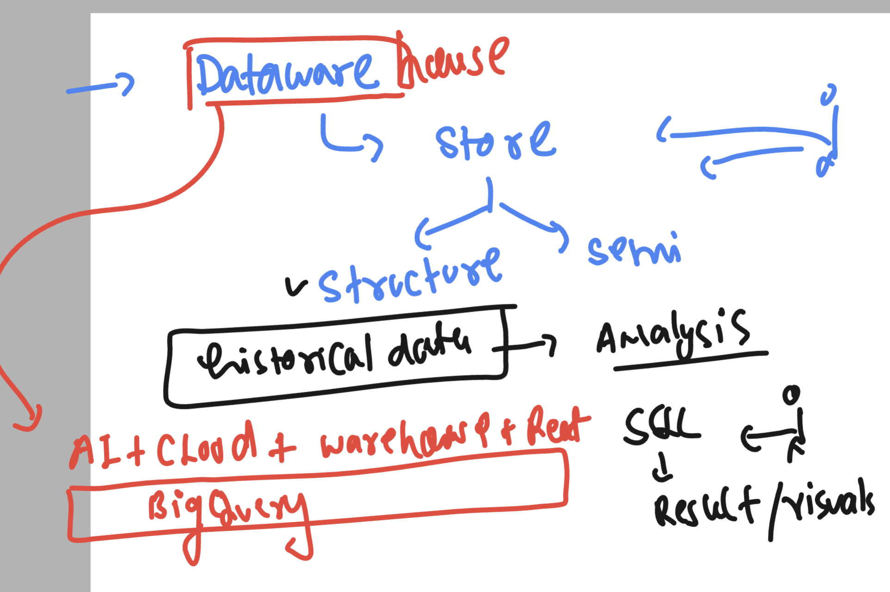

## revision 

### info basic 




### Collation in Bigquery 

[click_here](https://cloud.google.com/bigquery/docs/reference/standard-sql/collation-concepts)


### save and schedule query 


### cron job 


### External table and Wildcard table options 


### query to wildcard table 

```
  -- i want print give details from 1930 to 1939 below temperature is in fohrenhight 
SELECT
  mo,
  da,
  year,
  max
FROM
  `bigquery-public-data.noaa_gsod.gsod193*`
WHERE 
  max != 9999.9 
ORDER BY
  max DESC
```

### using _TABLE_SUFFIX in bigquery wildcard tables options 

```sql
  -- i want print give details from 1930 to 1939 below temperature is in farenheit
SELECT
  mo,
  da,
  year,
  ROUND((max-32)*5/9,1) celsius,
  max
FROM
  `bigquery-public-data.noaa_gsod.gsod193*`
WHERE
  max != 9999.9
  AND ( _TABLE_SUFFIX = '1'
    OR _TABLE_SUFFIX = '3'
    OR _TABLE_SUFFIX = '7' )
ORDER BY
  max DESC
```
