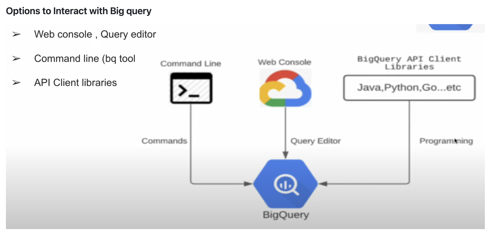
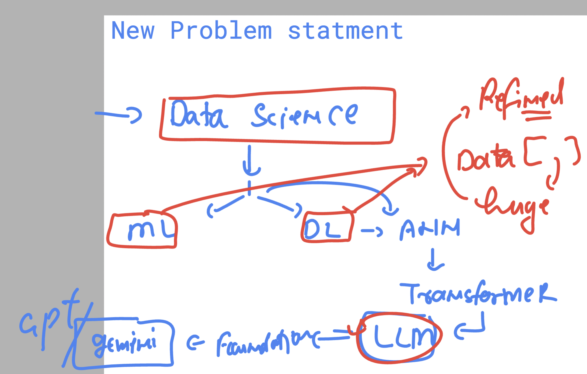
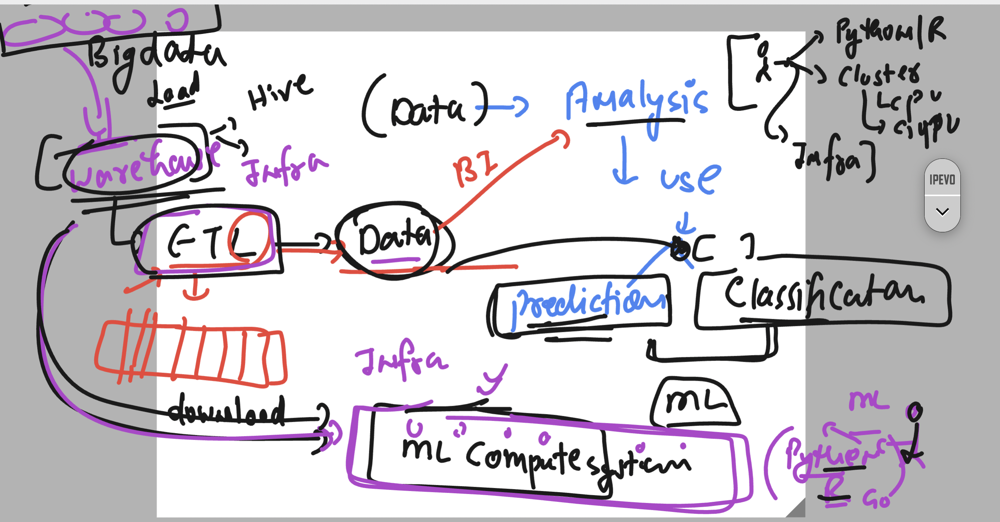
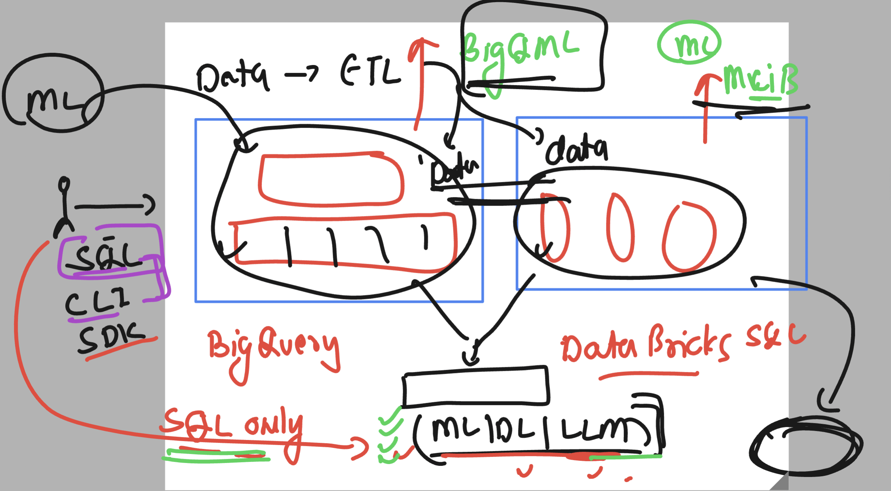

## Revision 

### Rev 1 



### cleaning few datasets with all tables 

```sql
drop schema `vodafonebigqproject-0011.ashudataset_002` CASCADE;
```


### creating external table 

```sql
-- add autodetect schema options in this query
CREATE EXTERNAL TABLE
  `vodafonebigqproject-0011.ashudataset_day3.ashu_ext_table2`
OPTIONS (
    format = 'CSV',
    uris = ['gs://ashu_bucket001/auto_detect.txt']
  );
```

## INtro with BQ 

```
learntechbyme@cloudshell:~ (vodafonebigqproject-0011)$ pip list  | grep -i bigquery 
google-cloud-bigquery    3.29.0
learntechbyme@cloudshell:~ (vodafonebigqproject-0011)$ bq  version
This is BigQuery CLI 2.1.12
learntechbyme@cloudshell:~ (vodafonebigqproject-0011)$ 

```

### in case you want to set current / any project to terminal 

```
gcloud config set project vodafonebigqproject-0011 
```

### listing datasets 

```
bq  ls
            datasetId            
 ------------------------------- 
  Anshika_dataset_001            
  Tushar_001                     
  alok_dataset001                
  alok_datatransfer              
  ankit_dataset001               
  ankit_dataset002_usmr          
  anshika_dataset_002            
  anshika_dataset_003            
  ashu_dataset001                
  ashudataset_day3               
```

### checking more details about dataset

```
bq  show   --format=prettyjson   ashudataset_day3 
{
  "access": [
    {
      "role": "WRITER",
      "specialGroup": "projectWriters"
    },
```

### creating dataset 

```
bq  mk  --dataset    --location=US  ashu_clidatasets
Dataset 'vodafonebigqproject-0011:ashu_clidatasets' successfully created.
learntechbyme@cloudshell:~ (vodafonebigqproject-0011)$ bq ls
            datasetId            
 ------------------------------- 
  Anshika_dataset_001            
  Tushar_001                     
  alok_dataset001                
  alok_datatransfer              
  ankit_dataset001               
  ankit_dataset002_usmr          
  anshika_dataset_002            
  anshika_dataset_003            
  ashu_clidatasets               
  ashu_dataset001                
  ashudataset_day3               
  car_dataset                    
  kartik_dataset_001             
```

### removing dataset (if empty)

```
 bq  rm   -d  ashu_clidatasets
 ```

### creating table 

```
bq mk --table  --dataset_id=ashudataset_day3  ashu_cli_table111 name:STRING,id:INTEGER
Table 'vodafonebigqproject-0011:ashudataset_day3.ashu_cli_table111' successfully created.
learntechbyme@cloudshell:~ (vodafonebigqproject-0011)$ 
learntechbyme@cloudshell:~ (vodafonebigqproject-0011)$ bq  ls --dataset_id=ashudataset_day3
       tableId          Type     Labels   Time Partitioning   Clustered Fields  
 ------------------- ---------- -------- ------------------- ------------------ 
  ashu_cli_table111   TABLE                                                     
  ashu_ext_table1     EXTERNAL                                                  
  ashu_ext_table2     EXTERNAL                                              

```

### select partitioned table with where clause 

```sql
SELECT name,_PARTITIONTIME as pt, _PARTITIONDATE as pd  FROM `vodafonebigqproject-0011.ashudataset_day3.ashu_part_table1` WHERE TIMESTAMP_TRUNC(_PARTITIONTIME, DAY) = TIMESTAMP("2025-01-29") LIMIT 1000

```

### Note: 
--: if partition type is day -- then 
-:  _PARTITIONTIME AND _PARTITIONDATE 
--
##### these 2 psuedo columns are getting created

## to check the Schema of partition table which is internal to bigquery 
### we can use sql _legacy model to run this query 

```sql
SELECT 
  *
FROM [ashudataset_day3.ashu_part_table1$__PARTITIONS_SUMMARY__]


```

## INtro to data scinece section 



### Introducing problems with earlier warehouses 



### any Modern dataware house 




