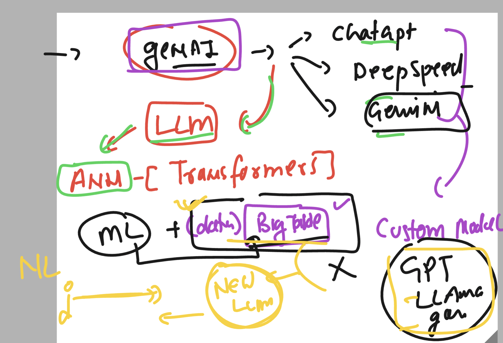

### Big query : all you need to Remember 

### Notice point 1 : 


### Notice point 2 :


### Notice point 3 


### Notice point 4 


### Creating UDF using SQL 

```sql
CREATE OR REPLACE FUNCTION `vodafonebigqproject-0011.ashu_finaldatasets.extract_domain`(email STRING) 
RETURNS STRING 
AS (
  SPLIT(email, "@")[SAFE_OFFSET(1)]
);

```

### analyzing most common email providers 

```sql
select `vodafonebigqproject-0011.ashu_finaldatasets.extract_domain`(email) AS domain,
COUNT(*) as user_count 
FROM `vodafonebigqproject-0011.ashu_finaldatasets.customer_emails`
GROUP BY domain 
ORDER BY user_count DESC

```

## Training lR model 

```sql
CREATE OR REPLACE MODEL `vodafonebigqproject-0011.ashu_finaldatasets.ashu_linear_house` OPTIONS(model_type='LINEAR_REG',
    input_label_cols=['price'] , early_stop=false, max_iterations=8, l2_reg=0.7, OPTIMIZE_STRATEGY="BATCH_GRADIENT_DESCENT") AS
SELECT
  avg_house_age,
  avg_rooms,
  avg_bedrooms,
  avg_income,
  population,
  price/100000 AS price

FROM  `vodafonebigqproject-0011.ashu_finaldatasets.ashu_usa_training` 
```

### to do evaluation use below query 

```sql
SELECT
  *
FROM
  ML.EVALUATE(MODEL `vodafonebigqproject-0011.ashu_finaldatasets.ashu_linear_house`)
```

### another way to evaluate 

```sql
-- fix this query
SELECT
    *
  FROM
    ML.EVALUATE(MODEL `vodafonebigqproject-0011.ashu_finaldatasets.ashu_linear_house`, TABLE `vodafonebigqproject-0011.ashu_finaldatasets.ashu_usa_eval`);
```

### doing evaluation 

```sql
-- fix this query
SELECT
    *
  FROM
    ML.EVALUATE(MODEL `vodafonebigqproject-0011.ashu_finaldatasets.ashu_linear_house`, (select * from `vodafonebigqproject-0011.ashu_finaldatasets.ashu_usa_eval`));
```

### predicting model 

```sql
SELECT
    *
  FROM
    ML.PREDICT(MODEL `vodafonebigqproject-0011.ashu_finaldatasets.ashu_linear_house`, (select * from `vodafonebigqproject-0011`.`ashu_finaldatasets`.`ashu_usa_eval`));
```

### Hyper Parameter 

[click_here](https://cloud.google.com/bigquery/docs/hp-tuning-overview)

## Time series models for Forecasting 


### GCP bigquery time series model support and other parameters

[click_here](https://cloud.google.com/bigquery/docs/reference/standard-sql/bigqueryml-syntax-create-time-series#modeling-pipeline)

## time series model training  (out of 10 years time series data we are using
#9 years data for training )

```sql
-- creating model using airma_plus and 9 years dataset 
CREATE OR REPLACE MODEL
  `vodafonebigqproject-0011.ashu_finaldatasets.ashu_arimamodel` OPTIONS(model_type='ARIMA_PLUS',
    time_series_timestamp_col='parsed_data',
    time_series_data_col='AvgHumidity' ) AS
SELECT
  *
FROM
  `vodafonebigqproject-0011`.`ashu_finaldatasets`.`ashu_weather_avghumid`
ORDER BY
  parsed_data
LIMIT
  3531
```

### Evaluation 


```sql
-- creating model using airma_plus and 9 years dataset 
SELECT
  *
FROM
  ml.evaluate(MODEL `vodafonebigqproject-0011.ashu_finaldatasets.ashu_arimamodel` ,TABLE `vodafonebigqproject-0011`.`ashu_finaldatasets`.`ashu_weather_avghumid` , STRUCT(FALSE AS PERFORM_AGGREGATION,
      0.9 AS CONFIDENCE_LEVEL,
     365 AS HORIZON
      )) where forecasted_AvgHumidity is not null order by parsed_data
  

```

## alternative 

```
SELECT
  *
FROM
  ml.arima_evaluate(MODEL `vodafonebigqproject-0011.ashu_finaldatasets.ashu_arimamodel`,
    STRUCT( FALSE AS show_all_candidate_models ) )
```

## Forecasting  for next 100 days 

```sql
SELECT
  *
FROM
  ML.FORECAST(MODEL `vodafonebigqproject-0011.ashu_finaldatasets.ashu_arimamodel`,
    STRUCT(100 AS horizon,
      0.9 AS confidence_level))
```

## Importing and exporting LLM models using tensorflow 



### column security 


