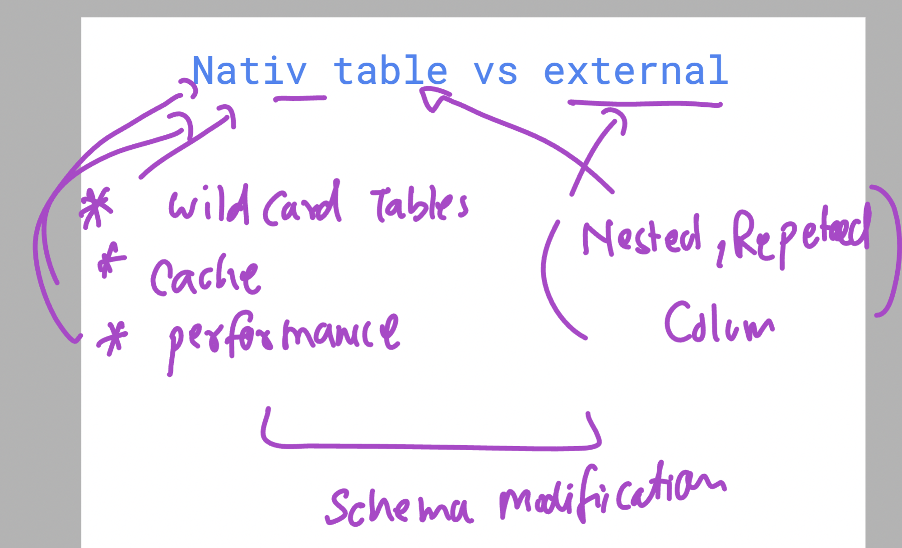

### Big query : all you need to Remember 

### Notice point 1 : 


### Notice point 2 :



### Notice point 3 


### Notice point 4 


### Creating UDF using SQL 

```sql
CREATE OR REPLACE FUNCTION `vodafonebigqproject-0011.ashu_finaldatasets.extract_domain`(email STRING) 
RETURNS STRING 
AS (
  SPLIT(email, "@")[SAFE_OFFSET(1)]
);

```

### analyzing most common email providers 

```sql
select `vodafonebigqproject-0011.ashu_finaldatasets.extract_domain`(email) AS domain,
COUNT(*) as user_count 
FROM `vodafonebigqproject-0011.ashu_finaldatasets.customer_emails`
GROUP BY domain 
ORDER BY user_count DESC

```

